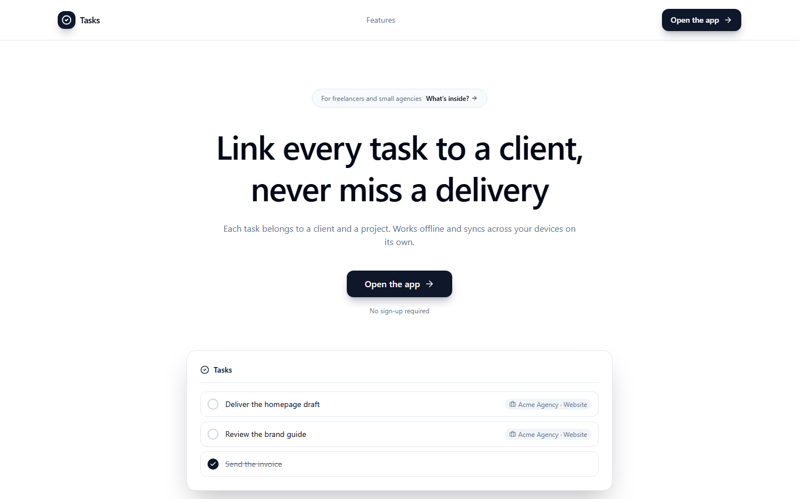
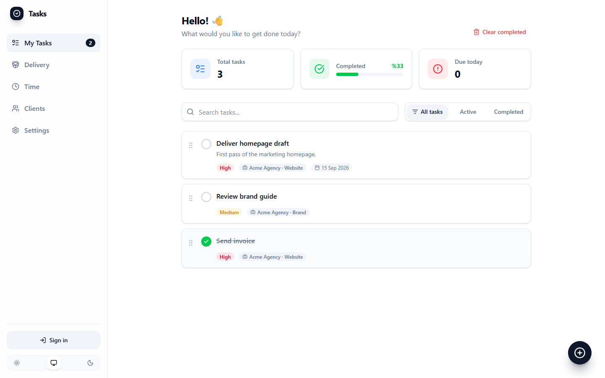
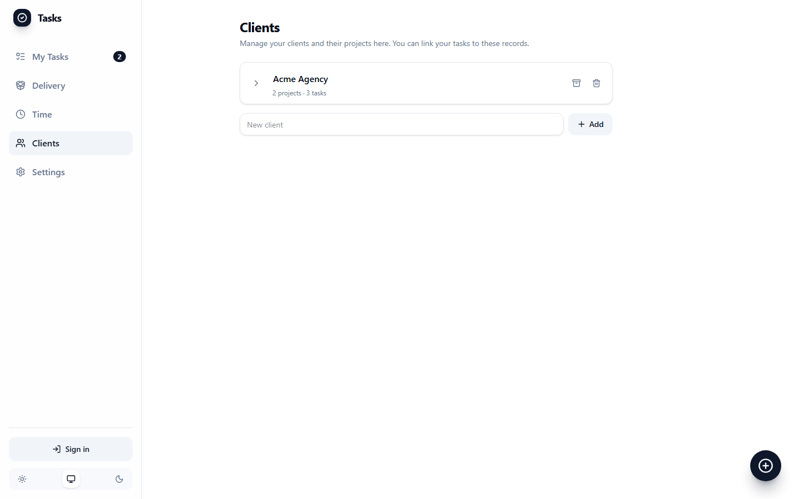
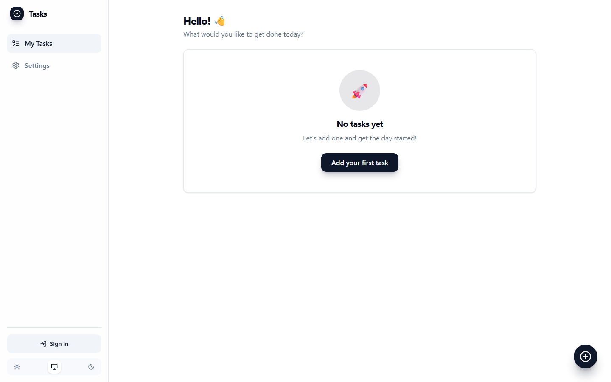

# Yapılacaklar

[](https://github.com/CanSrl/New-Era-To-Do-App/actions/workflows/ci.yml)

Local-first task app and a commercial SaaS starter kit (auth, sync, optional billing) with a **removable** niche module: client/project-linked work, a delivery view, and time logs for freelancers and small agencies.

Supabase is optional. With no cloud env, the UI never shows sign-in and data stays on the device.



## Quick start

```bash
npm install --legacy-peer-deps
npm run dev
```

Open http://localhost:5173 — the app is `/app`. Node 18+.

Local auth, sync, and demo rows (Docker):

```bash
npx supabase start
# put API URL + anon key in .env.local, then:
npx supabase db reset
```

Sign in as `demo@example.com` / `demodemo1`. Full steps: [docs/setup.md](docs/setup.md).

## Product

| | |
| --- | --- |
| Tasks | Categories, priorities, due dates, drag-and-drop, JSON import/export |
| Niche (default on) | Clients, projects, delivery grouping, timer, CSV |
| Sync | Optional account; last-write-wins; tombstones for deletes |
| i18n | Turkish + English |
| PWA | `start_url` is `/app` |
| Billing | LemonSqueezy adapter, default **off** |





With `VITE_NICHE_MODULE=false` the Delivery / Time / Clients routes are gone (same tasks shell):



## Docs

| | |
| --- | --- |
| [Setup](docs/setup.md) | Local + cloud Supabase, demo user |
| [Architecture](docs/architecture.md) | Store, sync order, RLS |
| [Theming](docs/theming.md) | Tokens, palette swap, self-hosted fonts |
| [Feature flags](docs/feature-flags.md) | `VITE_*` and niche stripping proof |
| [Deploy](docs/deploy.md) | Vercel / Netlify, headers, env |
| [Niche module](docs/niche-module.md) | How to delete it for real |
| [Billing](docs/billing.md) | LemonSqueezy, secrets, Pro gate |
| [Teams](docs/teams.md) | `workspace_id` path — not built |

## Commands

| Command | |
| --- | --- |
| `npm run dev` | http://localhost:5173 |
| `npm run build` | Production bundle (`dist/` is cleaned first) |
| `npm test` | Vitest |
| `npm run test:e2e` | Playwright |
| `npm run test:rls` | Schema security (local Supabase) |
| `npm run verify:niche` | Off-build has no niche traces and is ≥20 KB smaller |
| `npm run db:types` | Regenerate `src/lib/database.types.ts` |

## Flags (short)

| Env | Default |
| --- | --- |
| `VITE_NICHE_MODULE` | on (`false` to strip) |
| `VITE_AUTH_GITHUB` | off |
| `VITE_BILLING` | off |
| `VITE_SENTRY_DSN` | unset (no Sentry download) |

`SUPABASE_SERVICE_ROLE_KEY` and LemonSqueezy secrets must **never** use a `VITE_` prefix.

## Stack

React 19, TypeScript, Vite 8, Tailwind v4, Zustand, Supabase, Radix, dnd-kit, framer-motion, react-i18next, PWA.

## License

Private repository. Starter-kit licensing is the publisher’s.
